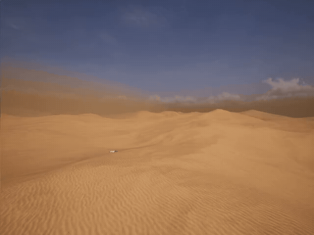
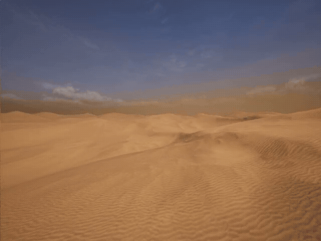
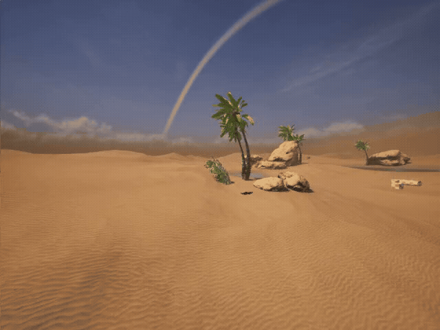

# RescueBench / Gym-Rescue

RescueBench is a search-and-rescue (SAR) embodied AI benchmark built on Unreal Engine and UnrealZoo. It extends the ATEC Championship 2025 Software Algorithm Track virtual rescue task into a standardized benchmark with multi-stage evaluation, progressive difficulty levels, baseline adapters, and expert-trajectory collection tools.

Official ATEC resources: [competition page](https://www.atecup.com/competitions/100009), [software algorithm repository](https://github.com/atecup/atec2025_software_algorithm).

## Problem Definition

RescueBench follows the virtual rescue problem defined by the ATEC 2025 Software Algorithm Track. At the beginning of each episode, the agent receives a color image and text description as initial cues. During execution, the agent observes the world from a first-person RGB camera through a Gym-like Python interface, issues real-time navigation and interaction actions, and receives reward feedback from the simulator.

The objective is to use the initial cues to locate the rescue target in a complex 3D scene, perform the required interaction, and deliver the target to a designated stretcher as efficiently as possible. The original ATEC platform used the same simulation environment for interaction, data collection, policy training, and final scoring; RescueBench builds on this setup with expanded SAR stages and standardized evaluation scripts.

<table>
  <tr>
    <td align="center">
      <a href="https://github.com/atecup/atec2025_software_algorithm/blob/main/Figure/image.png">
        
      </a><br>
      <b>Simulation environment and first-person observations</b>
    </td>
    <td align="center">
      <a href="https://github.com/atecup/atec2025_software_algorithm/blob/main/Figure/task_cue.png">
        
      </a><br>
      <b>Initial image and text cues</b>
    </td>
  </tr>
</table>

<p align="center"><sub>Figures from the official <a href="https://github.com/atecup/atec2025_software_algorithm">ATEC 2025 software algorithm repository</a>.</sub></p>

## Highlights

- A four-stage SAR benchmark with sequential dependencies.
- Five difficulty levels covering visual clutter, long-range search, indoor-outdoor transitions, and multi-floor layouts.
- A standardized benchmark framework under `benchmark/`.
- Baseline adapters and runners for multiple embodied navigation models.
- An automatic data collection pipeline under `example/RescueDataCollection.py`.
- A planned Hugging Face dataset release with approximately 400K expert steps.

---

## Demo / Qualitative Examples

The following examples show RescueBench episodes across different maps, agents, and difficulty settings.

### Benchmark demos

<table>
  <tr>
    <td align="center">
      <br>
      <b>FlexibleRoom / ROCKET</b>
    </td>
    <td align="center">
      <br>
      <b>FlexibleRoom / ROCKET</b>
    </td>
    <td align="center">
      <br>
      <b>FlexibleRoom / YOLO Planner</b>
    </td>
  </tr>
  <tr>
    <td align="center">
      <br>
      <b>Downtownwest / Uni-NaVid</b>
    </td>
    <td align="center">
      <br>
      <b>Forglar_Map / ViNT</b>
    </td>
    <td align="center">
      <br>
      <b>Forglar_Map / Uni-NaVid</b>
    </td>
  </tr>
  <tr>
    <td align="center">
      <br>
      <b>Tokyo / Uni-NaVid</b>
    </td>
    <td align="center">
      <br>
      <b>HongKongStreet / Uni-NaVid</b>
    </td>
    <td align="center">
      <br>
      <b>SuburbNeighborhood_Day / ROCKET</b>
    </td>
  </tr>
</table>

### Heterogeneous multi-agent cooperation for SAR

<table>
  <tr>
    <td align="center">
      <br>
      <b>SPF UAV Search</b>
    </td>
    <td align="center">
      <br>
      <b>SPF UAV Search</b>
    </td>
    <td align="center">
      <br>
      <b>SPF UAV Search</b>
    </td>
  </tr>
  <tr>
    <td align="center">
      <br>
      <b>SPF UAV Search (First 2s)</b>
    </td>
    <td align="center">
      <br>
      <b>Ground agent</b>
    </td>
    <td align="center">
      <br>
      <b>Ground agent</b>
    </td>
  </tr>
</table>
---

## What Is Released

| Component | Path / Link | Description |
|-----------|-------------|-------------|
| Gym-Rescue environment | `gym_rescue/` | Gym registration, UnrealCV interaction, and Rescue task configuration |
| Benchmark framework | `benchmark/rescue_benchmark.py` | Unified evaluation entry point, state machine, metric logging, and result export |
| Baseline runners | `benchmark/run_*.py` | Thin launchers for individual baselines |
| Baseline adapters | `benchmark/agents/` | Adapter layer for third-party embodied navigation models |
| Benchmark utilities | `benchmark/utils/` | Collision detection, progress tracking, trajectory similarity, and task state machine |
| Test point configs | `gym_rescue/envs/setting/test_jsonl/` | Test configurations for different difficulty levels |
| Data collection pipeline | `example/RescueDataCollection.py` | Automatic expert trajectory and interaction data collection |
| Human control example | `example/Rescue_HumanControl.py` | Human-control interface for trajectory collection and debugging |
| Dataset | `https://huggingface.co/datasets/WuKui-buaa/RescueBench/tree/main` | Oracle trajectories across test dataset |

---

## Dataset

| Item | Link / Description |
|------|--------------------|
| Collected Oracle trajectories |  `https://huggingface.co/datasets/WuKui-buaa/RescueBench/tree/main` |
| Contents | Oracle trajectories used in paper  |
| Related pipeline | `example/RescueDataCollection.py` |

The dataset corresponds to the oracle reference trajectories mentioned in the paper. Each episode records a complete rescue trajectory, including navigation to the injured person, rescue interaction, return navigation, and handoff. 

---

## Installation Strategy

This repository provides the Gym-Rescue environment and the RescueBench evaluation layer. The third-party baselines may require different PyTorch, CUDA, Transformer, or custom dependency versions. We recommend the following order:

1. Clone this repository and the official repositories for the baselines you want to evaluate.
2. Install and validate each third-party baseline following its official README.
3. Return to the `RescueBench` root directory and run `pip install -e .`.
4. If dependencies conflict, use separate conda environments for different baselines.

Example:

```bash
# 1) Clone this repository
git clone https://github.com/wukui-muc/RescueBench

# 2) Clone third-party model repositories as needed
git clone https://github.com/jzhzhang/Uni-NaVid
git clone https://github.com/robodhruv/visualnav-transformer

# 3) Install each baseline following its official README
# ...

# 4) Install Gym-Rescue / RescueBench last
cd RescueBench
pip install -e .
```

---

## Install Gym-Rescue

### Dependencies

- UnrealCV
- Gym
- OpenCV / CV2
- Matplotlib
- NumPy
- Docker / Nvidia-Docker (optional)

We recommend using [Anaconda](https://www.anaconda.com/download) or Miniconda to manage Python environments.

```bash
git clone https://github.com/wukui-muc/RescueBench
cd RescueBench
pip install -e .
```

The installation will install the dependencies declared in `setup.py`, such as `gym==0.26.0`, `unrealcv`, `opencv-python`, `numpy`, `matplotlib`, `wget`, and `docker`.

If OpenCV is missing, install it with either conda or pip:

```bash
conda install -c conda-forge opencv
# or
pip install opencv-python
```

---

## Prepare Unreal Binary

Before running RescueBench, prepare the Rescue Unreal binary.

| Environment | Download Link | Size |
|-------------|---------------|------|
| Rescue | [Download](https://huggingface.co/datasets/WuKui-buaa/RescueBench/tree/main) | ~8GB |

After downloading, unzip the binary into an `UnrealEnv/` directory:

```text
UnrealEnv/
└── Rescue_Win64/ or Rescue_Linux/
```

If permission issues occur on Linux, grant execute permission to the binary:

```bash
chmod +x ./Rescue
```

Set the environment variable before running:

```bash
export UnrealEnv=/your/path/to/UnrealEnv
```

If needed, the binary path can also be specified in the environment configuration files under `gym_rescue/envs/setting/env_config/`.

---

## Baseline Model Repositories

The full third-party model code and weights should be obtained from the official repositories. This repository provides the RescueBench adapters, runners, and evaluation protocol. Large model checkpoints and full upstream codebases should not be committed directly into the main Git history.

| Model | Official Repository / Page | RescueBench Adapter |
|-------|-----------------------------|---------------------|
| ViNT / NoMaD | [robodhruv/visualnav-transformer](https://github.com/robodhruv/visualnav-transformer), [project page](https://general-navigation-models.github.io/vint/) | `benchmark/run_visualnav.py`, `benchmark/agents/vint_agent.py`, `benchmark/agents/nomad_agent.py`, `benchmark/agents/nomad_yolo_agent.py` |
| Uni-NaVid | [jzhzhang/Uni-NaVid](https://github.com/jzhzhang/Uni-NaVid), [Hugging Face](https://huggingface.co/Jzzhang/Uni-NaVid) | `benchmark/run_uni_navid.py`, `benchmark/agents/uninavid_agent.py` |
| CityWalker | [ai4ce/CityWalker](https://github.com/ai4ce/CityWalker) | `benchmark/run_citywalker.py`, `benchmark/agents/citywalker_agent.py` |
| OmniNav | [amap-cvlab/OmniNav](https://github.com/amap-cvlab/OmniNav) | `benchmark/run_omninav.py`, `benchmark/agents/omninav_agent.py` |
| See, Point, Fly (SPF) | [Hu-chih-yao/see-point-fly](https://github.com/Hu-chih-yao/see-point-fly) | `benchmark/run_seepointfly.py`, `benchmark/agents/seepointfly_agent.py` |
| ROCKET-2 / R2ZeroShot | [CraftJarvis/ROCKET-2](https://github.com/CraftJarvis/ROCKET-2) | `benchmark/run_r2zeroshot.py`, `benchmark/agents/r2zeroshot_agent.py` |

By default, place third-party model workspaces under `baseline_model/<ModelName>/`, or specify paths through environment variables:

```bash
export R2ZEROSHOT_WORKSPACE=/path/to/ROCKET-2/workspace
export APEX_WORKSPACE=/path/to/Apexcode/apex_code
```

---

## Running the Benchmark

### Smoke Test

Use the random agent to verify the Unreal binary, Gym interface, and benchmark loop without requiring model weights:

```bash
cd benchmark
python rescue_benchmark.py --model random --levels 1 --episodes 1
```

### Baseline Examples

```bash
# Uni-NaVid
cd benchmark
python run_uni_navid.py --levels 1 --episodes 1 --render

# ViNT / NoMaD
cd benchmark
python run_visualnav.py --model nomad --topomap-dir ./rescue_topomaps --levels 2 --episodes 1 --render

# R2ZeroShot / ROCKET-2
cd benchmark
python run_r2zeroshot.py --levels 1 --episodes 1 --render

# OmniNav
cd benchmark
python run_omninav.py --levels 1 --episodes 1 --render

# CityWalker
cd benchmark
python run_citywalker.py --levels 3 --episodes 1 --render
```

See `benchmark/README.md` for detailed command-line arguments and evaluation options.

---

## Benchmark Architecture

| Layer | Path | Description |
|-------|------|-------------|
| Evaluation core | `benchmark/rescue_benchmark.py` | State machine, metric logging, result export, and unified Agent interface |
| Thin runners | `benchmark/run_*.py` | Model-specific launchers with preset arguments |
| Agent adapters | `benchmark/agents/` | Adapters for third-party baselines, including `agent_template.py` |
| Utilities | `benchmark/utils/` | Collision detection, trajectory similarity, progress tracking, and task state machine |
| Topomap helper | `benchmark/collect_rescue_topomap.py`, `benchmark/agents/topomap_utils.py` | Helper tools for topological-map-based methods such as ViNT and NoMaD |
| Documentation | `benchmark/README.md` | Metrics, state machine, CLI arguments, and new-model integration guide |

Test points are driven by `gym_rescue/envs/setting/test_jsonl/level_<L>.jsonl`. Each line contains fields such as `env_id`, agent start location, injured-person location, stretcher/ambulance location, and timeout. The benchmark automatically switches environments based on `env_id`.

---

## Data Collection Pipeline

The automatic data collection script is:

```text
example/RescueDataCollection.py
```

The pipeline uses an internal navigation controller to execute the full rescue workflow and save expert trajectories. It can be used to construct RescueBench training/validation data, generate topological maps, debug test points, and verify environment navigability.

### Inputs

- Unreal Rescue binary and a valid `UnrealEnv` path.
- Benchmark test points from `gym_rescue/envs/setting/test_jsonl/level_<L>.jsonl`.
- Environment configuration files under `gym_rescue/envs/setting/env_config/`.
- Optional level list, output directory, and video settings.

### Outputs

- `.pt` episode files.
- Trajectory states including pose, action, picked flag, reward, and timestamp.
- RGB/RGBD observations saved inside trajectory records.
- Optional `.mp4` videos for failed, timeout, or debug episodes.
- Collection logs for timeout, failure, and navigation errors.

### Example Command

```bash
python example/RescueDataCollection.py \
    --levels 2 3 4 \
    --trajectory-dir /path/to/auto_trajectories \
    --resume-missing \
    --record-video \
    --video-dir /path/to/auto_videos
```

Before publishing the dataset, the Hugging Face dataset card should include the directory layout, `.pt` field definitions, train/validation split, relation to `test_jsonl`, license, usage limitations, environment version, and generation parameters.

---

## Reproducing Paper Results

The main paper results are generated by the unified evaluation framework under `benchmark/`. Full reproduction requires:

1. Installing Gym-Rescue and the Rescue Unreal binary.
2. Preparing the official code and weights for each baseline.
3. Running the corresponding `benchmark/run_*.py` script.
4. Aggregating TCR, Task Score, Average Time, Collision, Human Similarity, and related metrics.

Template command:

```bash
cd benchmark
python run_<model>.py --levels 1 2 3 4 5 --episodes 5 --output ./benchmark_results/<model>
```

For a quick artifact check, start with the smoke test in the "Running the Benchmark" section.

---

## Repository Structure

```text
RescueBench/
├── gym_rescue/                  # Gym environment registration and Rescue task configs
├── benchmark/                   # RescueBench evaluation framework
│   ├── rescue_benchmark.py
│   ├── run_*.py
│   ├── agents/
│   └── utils/
├── example/                     # Data collection and human-control examples
│   ├── RescueDataCollection.py
│   └── Rescue_HumanControl.py
├── baseline_model/              # Optional local third-party model workspaces
├── setup.py
└── README.md
```

---

## Adding a New Model

To integrate a new model:

1. Copy `benchmark/agents/agent_template.py` and implement a new Agent.
2. Copy an existing `benchmark/run_*.py` launcher and update model-specific arguments.
3. Call the unified benchmark entry point in `benchmark/rescue_benchmark.py`.
4. Run a small smoke test to verify action format, rendering, state-machine behavior, and metric output.

See `benchmark/README.md` for more details.

---

## Acknowledgments

<table>
  <tr>
    <td align="center" bgcolor="#111111">
      <a href="https://www.atecup.com/competitions/100009">
        
      </a>
    </td>
  </tr>
</table>

<p align="center"><sub>ATEC logo sourced from the <a href="https://www.atecup.com/">official ATEC website</a>.</sub></p>

RescueBench / Gym-Rescue builds on the virtual rescue task and simulator released for the [ATEC Championship 2025 Software Algorithm Track](https://www.atecup.com/competitions/100009). We thank the ATEC organizers for providing the official competition platform, task definition, simulator interface, and baseline repository.

We also acknowledge [UnrealCV](https://unrealcv.org/), OpenAI Gym, [Unreal Engine](https://www.unrealengine.com/), and [UnrealZoo](https://unrealzoo.site/) for the simulation and interaction infrastructure that Gym-Rescue builds on.
